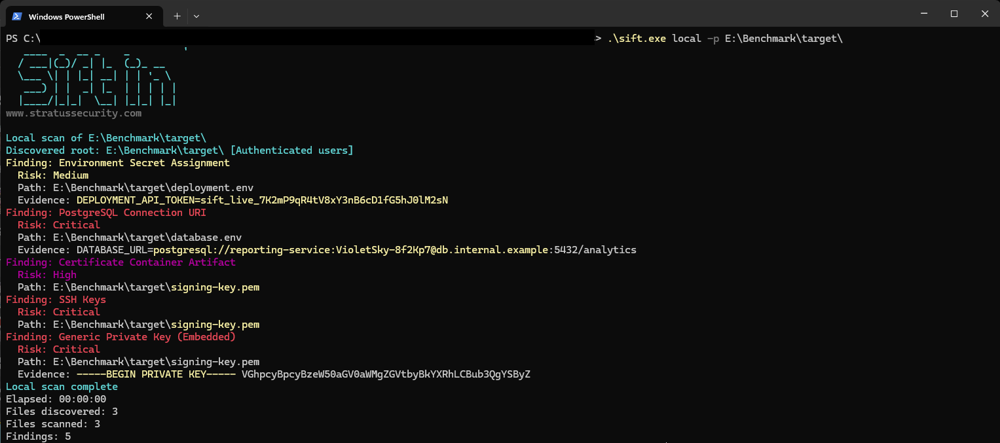

# Stratus Sift

<p align="center">
  
</p>

## What's this?
Sift is a tool developed by Stratus Security to improve our penetration testing, open-sourced to help improve data security for pentesters and security teams.
It searches data you can access for secrets and sensitive information across a number of platforms and it's *very* effective.

## TL;DR: How do I run this?
The quickest way, if you're familiar with Snaffler, is:
```
.\sift.exe local --path C:\
```

For more advanced commands, check out the [how to](#how-do) section below. It's worth a look.

## Why make this? Is this Snaffler?
Like most things we make, Sift is a tool developed out of frustration. For a while we used a custom fork of Snaffler like many in the industry, but ultimately it became harder to continue maintaining the fork than it was to just make it from scratch.

Sift was made with performance and extensibility in mind, to name a few great improvements over existing solutions:
- Self-contained Native AOT executables with no separate .NET runtime installation.
- Connector flexibility: It's modular to allow scanning anything with a small adapter (currently supports local drives, local networks and subnets, AD, SharePoint, Slack and Atlassian (Jira and Confluence)). Suggestions for more are welcome!
- Resumability: Every scan command can continue from durable checkpoints, so an interrupted scan only repeats a small amount of work.
- Performance: Local and SMB scans use a bounded high-throughput pipeline with compiled rules and reusable scan state. See [Benchmarks](#benchmarks) for the test method and measured results.
- Explicit authentication: Use the current identity or supply credentials directly. Kerberos is preferred for domain accounts, with controlled NTLM fallback and a strict Kerberos mode.
- Safety features: Dodges unsynced OneDrive files instead of filling up a server's drives by accessing them all... hypothetically.
    - If you're worried about coverage, OneDrive is backed by SharePoint, so scanning SharePoint is better than scanning local drives :D
- File support: You can optionally include binary files such as Word documents. Support isn't perfect yet, but you can't have everything!
- AI: We love some AI, but we also love privacy. And cake. The data gathered by Sift is extremely sensitive, so AI filtering uses only local LLMs to remove false positives.
- Cross-platform: The tool works on macOS, Windows and Linux (with varying feature support, of course!).
- Throttling: The pentesting CLI uses the available machine by default. Use `--threads` and `--max-read-mib-per-second` when scanning a sensitive production target.
- Detection quality: The bundled catalogue covers the Snaffler rules library, adds more detections, and refines noisy patterns. Code-defined validators support advanced checks and reduce false positives 📔
- DNS: Custom DNS servers for those times when you want to use computer names from a non-corp, wowee!
- Deeper inspection: The tool checks both the head and tail of the document instead of just a smaller head.
- ZIPin': Archives are enumerated and reported as `archive.zip!/path/file`. Terms and conditions may apply* (so we don't trigger a zip bomb)

## This is confusing, how do I just find the features I want?
The good ol' help flag will show the available commands:

```
> .\sift.exe --help

Usage:
  sift [command] [options]

Commands:
  local      Scan a local folder
  domain     Crawl the current Active Directory domain by auto-discovering accessible SMB shares.
  network    Crawl SMB targets on a subnet or a single device.
  m365       Scan Microsoft 365 content, including SharePoint, OneDrive, and Teams channel files
  slack      Scan accessible Slack channel messages and attachments
  atlassian  Scan accessible Jira projects and Confluence pages, blog posts, comments, and attachments
  analyze    Replay saved JSON findings and optionally re-run LLM validation offline
```

and slap a command on to get help for that specific one:
```
> .\sift.exe domain --help

Usage:
  sift domain [options]

Options:
  -b, --binary                                  Include binary files in scan.
  -e, --enum-only                               Enumerate discovered drives, shares, or roots and exit without scanning file content.
  --llm-validate                                Validate classifier matches with a local Ollama model before reporting findings.
  --llm-sensitive-only                          Only keep findings that the LLM classifies as sensitive. Requires --llm-validate.
  --ollama-url <ollama-url>                     Base URL for the Ollama server. [default: http://localhost:11434]
  --ollama-model <ollama-model>                 Ollama model to use for classifier validation. If omitted with --llm-validate, an interactive prompt is used when possible.
  --llm-timeout-seconds <llm-timeout-seconds>   Timeout for each Ollama validation request in seconds. [default: 20]
  --snaffler, --snaffler-mode                   Render console and CLI text output in Snaffler's logging style.
  -r, --rules <rules>                           Path to a folder containing sifting rules (JSON). If not provided, bundled defaults are used.
  -o, --output <output>                         Write scan output to a file. Resumed scans append; new scans replace it.
  -f, --output-format <output-format>           Output file format. Supported values: cli, json.
  --resume                                      Continue from durable checkpoints saved by an earlier scan with the same target, credentials, rules, and scan settings.
  -u, --username <username>                     Windows username for SMB/LDAP impersonation. Accepts user, domain\user, or user@domain.
  -p, --password <password>                     Windows password for SMB/LDAP impersonation.
  -d, --domain <domain>                         Windows/AD domain for impersonation when --username is not already qualified.
  -l, --local                                   Use the local machine account namespace instead of a domain account.
  -k, --kerberos                                Require Kerberos for LDAP and SMB authentication and reject the default per-host NTLM fallback. Use DNS hostnames for service principals.
  --dns-server <dns-server>                     Send A, AAAA, and PTR queries directly to this DNS server IP address.
  -dc, --domain-controller <domain-controller>  Domain controller hostname or IP address to use for LDAP discovery if auto-discovery fails.
  -?, -h, --help                                Show help and usage information
```

## Benchmarks

To quantify performance, we ran comparable scans against synthetic file repositories. Snaffler was patched to report completion immediately instead of waiting for its once-per-minute check-in, keeping the comparison fair.

These three benchmark scenarios used the current Sift and Snaffler builds on 24 August 2026.

| Scenario | Sift | Snaffler |
| --- | ---: | ---: |
| 250,000 small files | 10.61 s | 25.48 s |
| 5.5 GiB content throughput | 0.69 s | 6.32 s |
| Deep and wide tree | 1.12 s | 2.37 s |

Each test was run three times. The aggregate averages are shown below:

| Metric | Snaffler 1.0.244 | Sift | Improvement |
| --- | ---: | ---: | ---: |
| Duration | 34.18 s | 12.42 s | 2.75x faster |
| Total CPU time | 276.56 s | 62.11 s | 4.45x less CPU time |
| Average CPU load | 25.3% | 15.6% | 1.62x lower load |
| Average memory | 337 MiB | 92 MiB | 3.68x lower memory |
| Memory-time | 11.24 GiB·s | 1.11 GiB·s | 10.1x less RAM-time |
| Peak memory | 429.5 MiB | 102.2 MiB | 4.20x lower peak |

Throughput is unlimited by default, as used above. Resource limits can be set explicitly when you need to reduce impact:

```powershell
.\sift.exe local --path C:\Shares --threads 8 --max-read-mib-per-second 32
```

## How Do?
In case you're wondering how to do the things, here are a few examples to get you started.

Scan a specific computer:
```powershell
.\sift.exe network --device SRV01 --output srv01-findings.log
```

Scan all shares in a domain from an unmanaged device:
```powershell
.\sift.exe domain --username pentester --password '<password>' --domain CONTOSO --domain-controller 10.0.0.10
```

Scan a subnet with a local admin:
```powershell
.\sift.exe network --subnet 10.0.0.0/24 --username Administrator --password '<password>' --local --output findings.log
```

Scan a local disk and then refine the results on another machine with a local LLM:
```powershell
.\sift.exe local --path C:\ --output findings.json --output-format json
.\sift.exe analyze --input findings.json --llm-validate --ollama-model gemma4:31b --sensitive-only --output findings.log
```

Analyze results in a terminal without rescanning:
```powershell
.\sift.exe analyze --input findings.json --snaffler
```

Continue a previous or incomplete scan:
```powershell
.\sift.exe local --path C:\ --resume --output findings.json --output-format json
.\sift.exe domain --resume
.\sift.exe network --subnet 10.0.0.0/24 --resume
.\sift.exe m365 --resume --output m365-findings.json --output-format json
```

`--resume` works with local, domain, network, Microsoft 365, Slack, and Atlassian scans. During active processing, Sift stages compact fingerprints in buffered sequential writes and makes them durable about every 30 seconds. It also stores source paging cursors where the provider supports them. The output file is flushed before a checkpoint advances. Use the same command and output path to continue one report; output is optional if you only need results in the terminal.

Checkpoints are selected automatically from the target, account or credentials, rules, and relevant scan settings. They contain opaque fingerprints and continuation state, not findings or credentials. Changed files are scanned again. Journals are capped at 128 MiB each, old journals expire after 30 days, and the checkpoint directory is kept within 512 MiB by default. A normal run starts over and replaces its output; a resumed run skips completed unchanged content and appends to its output. `--resume` cannot be combined with `--enum-only`.

## Scan sources

Sift includes commands for:

- Local files and folders.
- Mounted filesystems, mapped drives, and Windows UNC shares.
- Host and subnet-based SMB discovery, with Kerberos and NTLM support.
- Active Directory discovery in regular and Native AOT Windows builds, with paged LDAP queries and signed, sealed authentication.
- Microsoft 365 content in SharePoint, OneDrive and Teams channel files.
- Slack messages and attachments.
- Atlassian Cloud content in Jira and Confluence.

## Download

Download the binary for your system from the [latest release](https://github.com/Stratus-Security/Sift/releases/latest).

| System | x64 | Arm64 |
| --- | --- | --- |
| Windows | [EXE](https://github.com/Stratus-Security/Sift/releases/latest/download/sift.exe) | [EXE](https://github.com/Stratus-Security/Sift/releases/latest/download/sift-win-arm64.exe) |
| Linux | [Binary](https://github.com/Stratus-Security/Sift/releases/latest/download/sift-linux-x64) | [Binary](https://github.com/Stratus-Security/Sift/releases/latest/download/sift-linux-arm64) |
| macOS | [Binary](https://github.com/Stratus-Security/Sift/releases/latest/download/sift-osx-x64) | [Binary](https://github.com/Stratus-Security/Sift/releases/latest/download/sift-osx-arm64) |

Check downloaded files against [SHA256SUMS.txt](https://github.com/Stratus-Security/Sift/releases/latest/download/SHA256SUMS.txt). Release binaries are not code-signed yet.

Sift is licensed under [AGPL-3.0-only](LICENSE). Report security problems through [SECURITY.md](SECURITY.md) and read [CONTRIBUTING.md](CONTRIBUTING.md) before sending a change.

🪲 If there are any problems, please feel free to open an issue (or PR!) 🪲

## Sifting rules

Sift uses two kinds of JSON rules:

- A **sifting rule** describes what to find and how to report it.
- An **ignore rule** skips known noise before Sift opens or scans it.

The bundled catalogue lives under [`src/Stratus.Sift.Core/Defaults/Data`](src/Stratus.Sift.Core/Defaults/Data). It is usually easiest to copy a nearby example and change it.

Pass a rule directory to any scan command with `--rules`:

```powershell
.\sift.exe local --path C:\Review --rules .\my-rules
```

Sift reads every `.json` file below that directory. A file may contain one rule or an array of rules. File and folder names are only for organisation. Comments, trailing commas and case-insensitive property names are accepted.

The custom directory is the complete catalogue for that scan. It replaces the bundled rules rather than adding to them. Include every sifting rule and ignore rule that you want to use. If Sift cannot load any sifting rules, it falls back to the bundled catalogue.

### Example custom rule

Create `acme-token.json`:

```json
{
  "Name": "Acme API Token",
  "Description": "Finds Acme API tokens in source and configuration files.",
  "Severity": "High",
  "Matches": [
    {
      "Target": "Content",
      "Patterns": [
        "\\bacme_[A-Za-z0-9]{32}\\b"
      ],
      "Keywords": [
        "acme_"
      ],
      "ExtensionProfile": "SourceAndConfig"
    }
  ],
  "EnableLlmValidation": false,
  "ExcludePaths": [ "**/test-fixtures/**" ]
}
```

A sifting rule requires only `Name` and `Matches`. Every other top-level field is optional. Every enabled rule reports its matches. Patterns within a rule are alternatives, so any matching pattern can produce a match.

| Field | Required | Purpose |
| --- | --- | --- |
| `Name` | Yes | Stable rule and finding name. |
| `Matches` | Yes | One or more metadata or content match blocks. |
| `FindingName` | No | Different name for the reported finding. The default is `Name`. |
| `Description` | No | Short explanation of what the rule detects. |
| `Severity` | No | `Info`, `Informational`, `Low`, `Medium`, `High`, or `Critical`. The default is `Medium`. |
| `Enabled` | No | Enables the rule. The default is `true`. |
| `Validator` | No | Built-in validation step used after a pattern matches. |
| `EntropyThreshold` | No | Minimum Shannon entropy for the matched value. `0`, the default, disables this check. |
| `EnableLlmValidation` | No | Allows the match to be checked when the scan uses `--llm-validate`. The default is `true`, but no LLM is called unless that command option is supplied. |
| `MinMatchCount` | No | Number of matches required on one item before a finding is kept. The default is `1`. |
| `IncludePaths` | No | Allowlist of full-path wildcard expressions. |
| `ExcludePaths` | No | Blocklist of full-path wildcard expressions. |
| `StopOnMatch` | No | Stops the current matching pass after this rule reports a match. The default is `false`. |
| `ReportFinding` | No | Set to `false` for a parent rule that only gates its `SubRules`. The default is `true`. |
| `SubRules` | No | Second-stage rules evaluated after their parent matches. |

Each item in `Matches` supports:

| Field | Required | Purpose |
| --- | --- | --- |
| `Patterns` | Yes | One or more literal values or .NET regular expressions. |
| `Target` | No | The part of the item to inspect. The default is `Content`. See the table below. |
| `IsLiteral` | No | Treats patterns as plain text. The default is `false`, which uses regex for content patterns. |
| `CaseSensitive` | No | Makes patterns and keywords case-sensitive. The default is `false`. |
| `Keywords` | No | Fast prefilter for content rules. At least one keyword must be present before the regex runs. The regex must still match. |
| `ExtensionProfile` | For content¹ | Named extension allowlist. `SourceAndConfig` is currently provided. |
| `IncludedExtensions` | For content¹ | Additional extensions such as `.txt`, `.config`, or `.ps1`. |

¹ A top-level content match must declare `ExtensionProfile`, `IncludedExtensions`, or both. A content `SubRule` inherits the scope established by its parent.

The available targets are:

| Target | What it checks |
| --- | --- |
| `Content` | File, message, page, issue, or attachment text. Patterns are regex unless `IsLiteral` is true. |
| `FileName` | The leaf filename, such as `id_rsa` or `secrets.json`. |
| `FileExtension` | The file extension, such as `.env` or `.pem`. |
| `DirectoryName` | An individual directory name, such as `.git`. |
| `DirectoryPath` | The full path. Plain values match the beginning of the path; regex patterns can express more complex scopes. |
| `ShareName` | The share component of a UNC path, such as `Finance` in `\\server\Finance`. |

Content rules must declare `ExtensionProfile`, `IncludedExtensions`, or both. The two lists are combined. This keeps broad content expressions away from file types where they are unlikely to be useful.

`Keywords` are an optimisation, not extra evidence. Choose a short literal that every valid match is expected to contain. Leave the list empty when no safe keyword exists. A poor keyword can prevent valid matches from being tested.

Content regexes have a one-second match timeout. Sift uses the .NET non-backtracking engine where the expression supports it. Keep expressions bounded and avoid broad forms such as `.*` across large regions. The entire regex match becomes the reported value; a capture group does not change which text is used as evidence.

`Validator` can add checks that are awkward to express safely in regex, such as a checksum or token structure. JSON rules can use the built-in names in the [`ClassifierValidatorCatalog`](src/Stratus.Sift.Core/Validation/ClassifierValidatorCatalog.cs). Adding a validator requires a code change. JSON files cannot load executable code.

Path scopes and ignore rules use filesystem wildcards such as `*`, `?`, and character classes, not regular expressions. Exclusions are checked after inclusions.

### Two-stage rules

Use a parent rule when a cheap metadata check should gate a more specific content check. Set `ReportFinding` to `false` on the parent, then place the reporting rules in `SubRules`:

```json
{
  "Name": "Acme credential file",
  "ReportFinding": false,
  "Matches": [
    {
      "Target": "FileName",
      "IsLiteral": true,
      "Patterns": [ "acme.json" ]
    }
  ],
  "SubRules": [
    {
      "Name": "Acme credential",
      "Severity": "Critical",
      "Matches": [
        {
          "Target": "Content",
          "Patterns": [ "\\\"token\\\"\\s*:\\s*\\\"([^\\\"]+)\\\"" ],
          "IncludedExtensions": [ ".json" ]
        }
      ]
    }
  ]
}
```

See [`Firefox Login Store.json`](src/Stratus.Sift.Core/Defaults/Data/Rules/Files/Firefox%20Login%20Store.json) for a bundled example.

### Ignore rules

Ignore rules remove known noise early. They use simple filesystem wildcards rather than regex.

```json
[
  {
    "Pattern": "node_modules",
    "MatchTarget": "DirectoryName",
    "Description": "Third-party Node dependencies",
    "IsEnabled": true
  },
  {
    "Pattern": "*.min.js",
    "MatchTarget": "FileName",
    "Description": "Generated minified JavaScript",
    "IsEnabled": true
  }
]
```

`MatchTarget` accepts the same target names as sifting rules. `Content` on an ignore rule is treated as a path match because ignore rules run before content is read. Directory, path, and share ignores can prune an entire branch, so test broad patterns carefully.

| Field | Required | Purpose |
| --- | --- | --- |
| `Pattern` | Yes | Filesystem wildcard to ignore. |
| `MatchTarget` | No | Part of the path to check. The default is `FileName`. |
| `Description` | No | Reason for the ignore rule. |
| `IsEnabled` | No | Enables the ignore rule. The default is `true`. |

### Testing a rule

Make a small fixture directory containing:

- One file that should match.
- Similar values that should not match.
- Examples in allowed and disallowed extensions.
- Uppercase and lowercase variants if case matters.
- A path covered by each include, exclude, or ignore rule.

Run only that fixture while developing:

```powershell
.\sift.exe local --path .\rule-fixtures --rules .\my-rules --output .\rule-test.log
```
